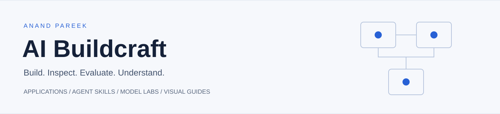
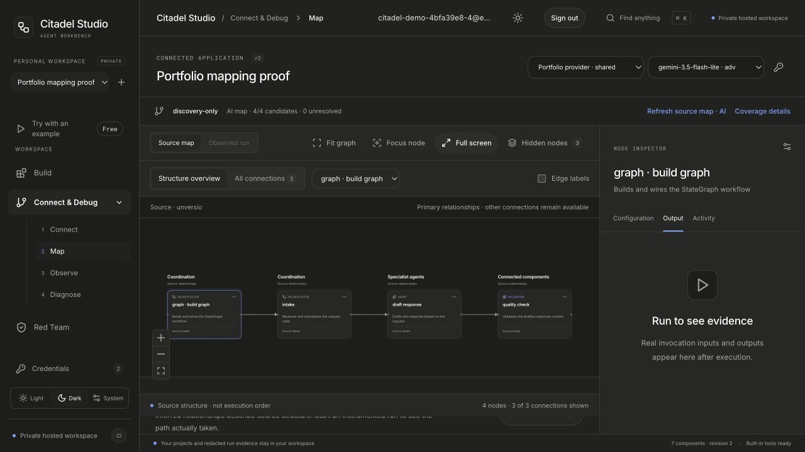
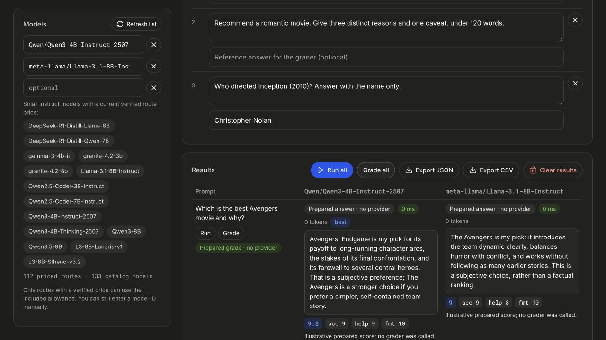
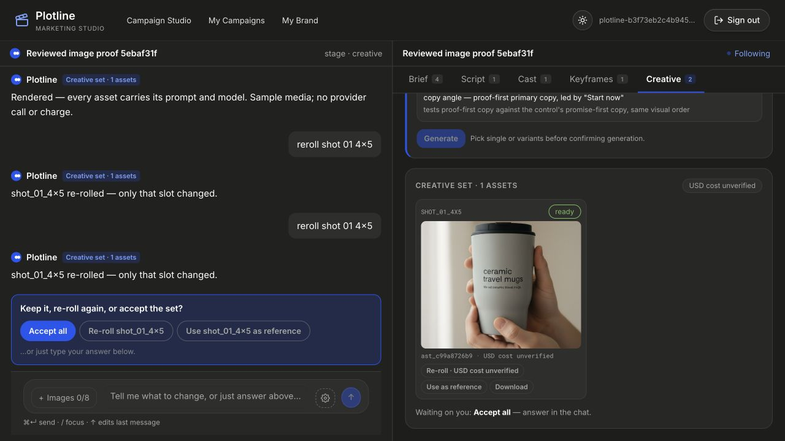
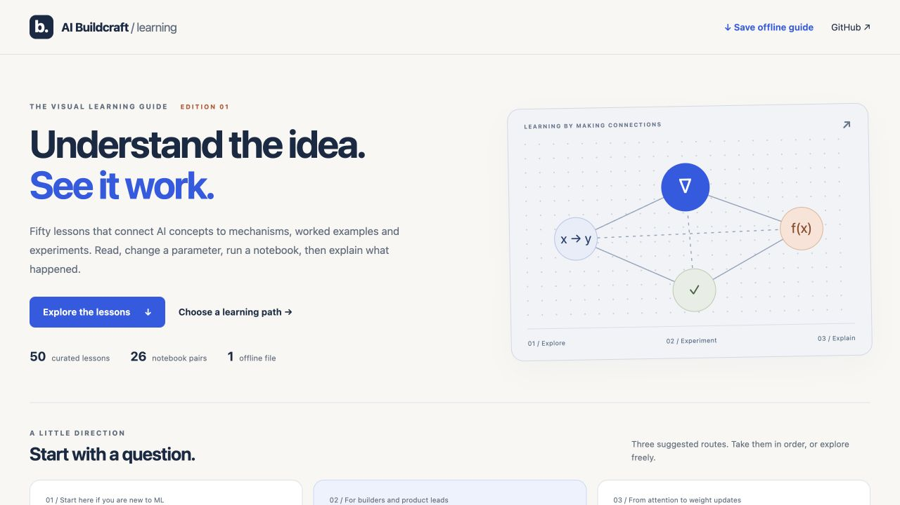
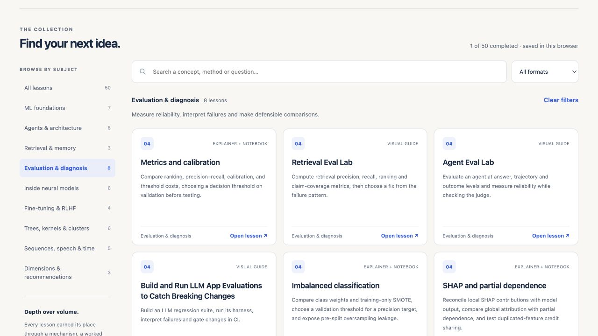

<p align="center"></p>

# AI Buildcraft

[](https://github.com/APareek89/ai-buildcraft/actions/workflows/validate.yml) [](https://apareek89.github.io/ai-buildcraft/)

**Practical AI systems, reusable skills, and hands-on labs.**

Explore how an AI product is built, inspect the decisions inside it, evaluate its behavior, and learn the underlying mechanisms. This collection brings together independently developed applications, portable agent skills, model-training experiments, and interactive visual lessons by **Anand Pareek**.

**[Open the learning guide](https://apareek89.github.io/ai-buildcraft/)** · **[Download one HTML](https://github.com/APareek89/ai-buildcraft/releases/latest/download/ai-buildcraft-learning-guide.html)** · **[Preview all projects locally](#run-the-collection-browser)** · **[Start with a lab](#model--machine-learning-labs)** · **[Contribute](CONTRIBUTING.md)**

> Source snapshots are included in this repository so the collection can be inspected without relying on links to earlier repositories. See [verification and scope](docs/VERIFICATION.md) for what has actually been tested.

## Start here

| You want to… | Start with | What you will see |
|---|---|---|
| Understand how models learn | [Post-Training Lab](labs/post-training/) | Prompting → CPT → SFT → DPO → RAG, with frozen evaluations and fictional data |
| See a transformer work | [LLM Anatomy](apps/llm-anatomy/) | Attention, predictions, gradients and weight updates in miniature teaching models |
| Inspect an agent's structure | [Citadel Studio](apps/citadel-studio/) | Source maps kept separate from observed execution evidence |
| Evaluate quality and cost | [Blindspot](apps/blindspot/) and [Model Arena](apps/model-arena/) | Traces, comparisons, grading and explicit review gates |
| Give a coding agent a reusable capability | [Skills](#agent-skills) | Persistent context, review, workflow mapping, presentation templating and analytics |
| Learn visually, without an API key | [Visual Learning Guide](learn/index.html) | 50 selected visual guides and paired ML notebooks |

## Run the collection browser

```bash
git clone https://github.com/APareek89/ai-buildcraft.git
cd ai-buildcraft
python3 -m http.server 8040 --bind 127.0.0.1
```

Open **http://127.0.0.1:8040**. GitHub displays HTML source; this local preview runs the collection browser. The [hosted learning guide](https://apareek89.github.io/ai-buildcraft/) runs directly in your browser, or download its single HTML from the [latest release](https://github.com/APareek89/ai-buildcraft/releases/latest). The collection browser and most visual lessons run without API keys. Each application has its own environment, dependencies and setup instructions; there is no single command that launches all apps.

## Applications

### Inspect and evaluate

| Application | What it does | Source |
|---|---|---|
| **Citadel Studio** | Map an agent repository, inspect source, build workflows and examine execution traces | [Open](apps/citadel-studio/) |
| **Blindspot** | Observe model calls and costs, create evaluation evidence, and review proposed routing changes | [Open](apps/blindspot/) |
| **Model Arena** | Compare model answers to the same task, grade them and export results | [Open](apps/model-arena/) |
| **GEO Radar MCP** | Expose brand-answer measurement and analysis through an MCP server | [Open](apps/geo-radar-mcp/) |

<p> </p>

### Create, research and learn

| Application | What it does | Source |
|---|---|---|
| **Demo Studio** | Turn source material into narrated tours, galleries and grounded question answering | [Open](apps/demo-studio/) |
| **Plotline** | Develop a campaign from a conversational brief through reviewed image and video assets | [Open](apps/plotline/) |
| **Framewise** | Generate and evaluate images through a bounded loop with human calibration | [Open](apps/creative-qc-agent/) |
| **Market Research Agents** | Coordinate research, analysis and review, then export a report | [Open](apps/market-research-agents/) |
| **Agentic Learning Studio** | Create interactive lessons, quizzes and notebook learning experiences | [Open](apps/agentic-learning-studio/) |
| **Jhalak** | Build and edit a small-business website with generated copy and media | [Open](apps/jhalak/) |

<p> </p>

### Apply a model to a domain

| Application | What it does | Source |
|---|---|---|
| **GetCited** | Explore AI brand mentions and turn findings into modeled action plans | [Open](apps/getcited/) |
| **GSTPilot** | Separate document extraction from deterministic calculations in a historical GST worked example | [Open](apps/gstpilot/) |
| **LLM Anatomy** | Explore transformer mechanisms using small trainable teaching models | [Open](apps/llm-anatomy/) |

Screenshots show existing application interfaces and prepared examples. They are not evidence of a new live provider run. The collection's migrated media integrations use **Google's Gemini API**, including Veo where video generation is supported. API availability, billing and model access depend on your own account. See each migrated app's `BUILDCRAFT.md`.

## Agent skills

| Skill | Capability | Source |
|---|---|---|
| **Keel** | Carry preferences, decisions and constraints between AI coding sessions through a local knowledge graph | [Open](skills/keel/) |
| **Power Coding** | Structure briefs, handoffs, evaluation loops and failure review | [Open](skills/power-coding/) |
| **Sharpen** | Apply a demanding expert-review persona before delivering a draft | [Open](skills/sharpen/) |
| **Agentic Learning Skill** | Produce self-contained interactive HTML lessons | [Open](skills/agentic-learning-skill/) |
| **Agentlane Diagram** | Turn actual source into an inspectable workflow map | [Open](skills/agentlane/) |
| **Deck from Template** | Build presentations from a measured reference template | [Open](skills/deck-from-template/) |
| **Analytics Toolkit** | Product analytics, revenue, SEO and performance-reporting workflows | [Open](skills/claude-skills-toolkit/) |
| **PixelBin Claude Skill** | Public PixelBin media API integration, retained as a dedicated provider skill | [Open](skills/pixelbin-claude-skill/) |

Install only the skills you need, following their individual instructions. The dedicated PixelBin skill intentionally keeps its public API identity; it is separate from the Gemini-backed application editions. Keel includes framework code and examples, never the author's personal knowledge base.

## Model & machine-learning labs

- **[Post-Training Lab](labs/post-training/):** evaluation-first CPT, SFT, DPO, RAG and refusal-training experiments. Includes fictional data, visible notebook steps, recorded results and their limitations. Existing results are not a claim that every experiment was rerun for this collection.
- **[ESCI SFT Dataset Builder](labs/esci-sft/):** prepare pointwise and listwise training examples, inspect data and score retrieval relevance. Download the source dataset yourself; its upstream license and notice are retained.
- **[ML Foundations](labs/ml-foundations/index.html):** 26 selected topic labs pairing an HTML explanation with a notebook, from leakage and metrics to probabilistic models, neural networks and model comparison.

Training notebooks can download datasets or model weights, use substantial memory and take time to run. Inspect the setup cells first. Notebook outputs in this collection are cleared; published result documents retain their explicitly stated scope.

## Visual Learning Guide

**50 selected lessons: 24 visual guides and 26 notebook/HTML labs.**



[Read online](https://apareek89.github.io/ai-buildcraft/) · [Download one complete HTML](https://github.com/APareek89/ai-buildcraft/releases/latest/download/ai-buildcraft-learning-guide.html) · [Source catalog](learn/catalog.json).

One self-contained file with a categorized card homepage, nine subjects, three learning paths, search, lesson navigation, completion tracking, 26 embedded notebook downloads and a glossary. Figures, mathematical typesetting and code highlighting work offline. Notebook execution needs Python and its dependencies; external reference links need internet access.

**Suggested paths:** build your first ML model; design a reliable AI agent; understand how models adapt.



- **Agent systems:** architecture decisions, orchestration, memory, frameworks and evaluation.
- **Retrieval:** document processing, retrieval, grounded answers and evaluation.
- **Model training:** fine-tuning, LoRA, preference learning and reward attribution.
- **ML Foundations:** 26 visual explanations linked to hands-on notebooks.
- **Inside the models:** additional learning artifacts recovered from the author's Claude library, reviewed and packaged as standalone pages.

[Selection criteria](learn/CURATION.md): mechanism, worked example or experiment, interpretation, and distinct learning value. Short diagram cards and weaker or repetitive lessons are excluded.

Lessons are educational material, not benchmarks or certification guarantees. Source attribution and license exceptions are recorded in [provenance](docs/PROVENANCE.md) and the learning catalog.

## How this repository is organized

```text
apps/                  Application source snapshots and local setup
skills/                Reusable agent skills and plugins
labs/                  Post-training, dataset preparation and ML notebooks
learn/                 Curated interactive HTML lessons
assets/screenshots/    Application interface images
docs/                  Provenance, verification and collection decisions
scripts/               Collection validation
```

## Contribute something useful

Good first contributions include reproducing a setup on a clean machine, improving one visual explanation, adding an evaluation case, documenting a failure mode, or extending an adapter with tests. Keep the contribution small enough for someone else to review and run.

The [18-app roadmap](docs/ROADMAP.md) prioritizes a tool contract tester, citation evidence auditor and SFT dataset quality gate.

Read [CONTRIBUTING.md](CONTRIBUTING.md), [SECURITY.md](SECURITY.md), and the [verification record](docs/VERIFICATION.md). Source availability does not mean every configuration is production-ready.

## License and attribution

Original collection material is available under the [MIT License](LICENSE). Directory-level licenses and notices take precedence for their material; Post-Training Lab and its derived RLHF lesson retain Apache-2.0. Third-party datasets, dependencies and models retain their own terms. See [THIRD_PARTY_NOTICES.md](THIRD_PARTY_NOTICES.md).

Built and maintained by **[Anand Pareek](https://github.com/APareek89)**. [Portfolio](https://anand-pareek.vercel.app/#projects).
