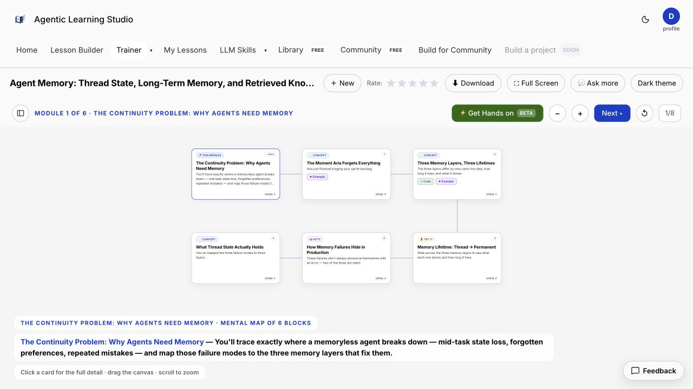

# Agentic Learning Studio

Learn agentic AI through interactive lesson maps, worked examples, knowledge checks and runnable Python notebooks. The main application builds lessons from topics, uploaded documents or public repositories; the bundled demo lets you explore the experience without an account or a model key.



## Free local demo

Use Node 22 or newer. From this directory:

```bash
npm ci --ignore-scripts
npm run demo
```

Open **http://127.0.0.1:5070**. Browse Library or choose **Try Agent Memory**, build the cached lesson, inspect its modules and download it. The demo serves 100 bundled lessons and clearly identifies prepared content. Progress lives in memory and resets when restarted. New AI generation, uploads, authentication and payments are disabled. The launcher drops inherited credentials and does not read `.env`.

## Main application

The authenticated application combines Express, Auth.js Credentials, PostgreSQL/pgvector, private S3 storage and configurable OpenAI/Anthropic agents. Lessons, notebooks and uploads are owner-scoped. Repository input supports public repositories; private repository authentication is not implemented.

The full application requires an operator-managed schema and private infrastructure; the included historical migrations are not a one-command fresh deployment. See [collection setup and limits](BUILDCRAFT.md). Start with the standalone demo above. Email password recovery and Google sign-in are not configured.

## Checks

```bash
npm run check
npm run test:provider-wire
npm run test:embedding-batches
npm run test:boundaries
# With npm run demo running:
npm run test:demo
```

Useful contribution areas: new lesson fixtures, accessibility checks, notebook validation and a reproducible fresh-database deployment recipe. [Source provenance](SOURCE.json) identifies the original snapshot. The screenshot illustrates the earlier portfolio UI; it is not a fresh live-provider verification.
