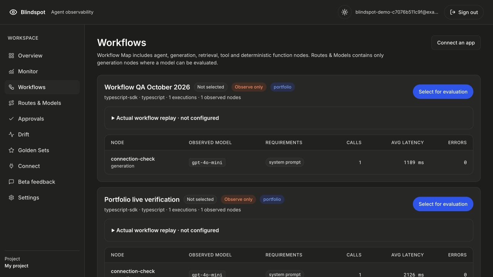

# Blindspot

Blindspot observes the model-powered parts of an existing AI agent, builds user-owned golden sets, compares compatible models within a reviewed budget, and surfaces recommendations. Its workflow view contains **observed, instrumented nodes**, not inferred source topology. Model-only screening does not prove a production swap is safe. Managed changes remain approval-gated; observe-only approvals wait for an external rollout.



Create a local account using the setup below, choose **Try with an example**, then inspect its prepared workflow and evaluation evidence. Prepared data makes no model-quality claim. Connecting an agent requires a separately minted SDK key. Screenshot: historical portfolio illustration.

## Repository map

```text
apps/gateway       OpenAI-compatible gateway, management API and authenticated span ingest
apps/dashboard     Next.js workspace, Auth.js Credentials and verified owner sessions
apps/worker        BullMQ worker entry point; local/hosted beta currently evaluates inline
packages/core      Golden, eval, recommendation, drift, onboarding and workflow services
packages/db        Drizzle schema and additive Postgres migrations
packages/providers Provider catalog/adapters and capability normalization
packages/sdk       TypeScript connector for existing applications
packages/shared    Zod schemas and shared types
docs/mermaid       Canonical architecture sources
```

## Local development and verification

Use Node 22 and the pinned pnpm version in `package.json`, plus an isolated PostgreSQL database. These startup commands assume that database is initialized: apply the eight `packages/db/drizzle/*.sql` files in filename order, then `packages/db/migrations/001_portfolio.sql`, once as the schema administrator. The runtime role must have schema USAGE and table SELECT/INSERT/UPDATE/DELETE, without schema CREATE, table ownership or TRUNCATE. `db:push` alone does not install the account/usage migration.

The historical `.env.example` is not a complete launch configuration. Supply environment variables to each process explicitly (the gateway loads the root `.env`; Next uses its own environment). Both need `DATABASE_URL`, a verified `DATABASE_SSL_CA_FILE`, `BLINDSPOT_AUTH_ENABLED=1`, `BLINDSPOT_MOCK_MODE=1`, and the same independently generated `BLINDSPOT_BRIDGE_SECRET` of at least 32 characters. For loopback development only, `DATABASE_SSL=disable` is accepted instead of a CA. The dashboard also needs an independent `AUTH_SECRET` of at least 32 characters, matching `APP_ORIGIN`/`AUTH_URL` such as `http://localhost:3001`, and `BLINDSPOT_GATEWAY_URL=http://localhost:8787`. The gateway needs its own 64-character lowercase hexadecimal `ENCRYPTION_KEY`, `BLINDSPOT_EVAL_MODE=inline`, and `BLINDSPOT_INTERNAL_GATEWAY_URL=http://localhost:8787`. Keep all provider-key variables absent in development. Use the same browser hostname as `APP_ORIGIN`; localhost and 127.0.0.1 are different origins. Redis is unused in inline mode.

```bash
pnpm install --frozen-lockfile
pnpm --filter @blindspot/sdk build
pnpm start:gateway
pnpm start:dashboard
```

Run gateway and dashboard in separate terminals. For an integrated production build alongside a running baseline, use `BLINDSPOT_DIST_DIR=.next-integrated pnpm --filter @blindspot/dashboard build` so the baseline build directory is preserved.

For a local agent, set its `BLINDSPOT_BASE_URL` to `http://localhost:8787` and supply its separately minted SDK key. The deployed same-origin `/v1` edge routing is an AWS proxy configuration, not a Next development-server rewrite. The hosted Connect snippets use the named public origin; do not substitute the private container hostname in an external agent.

```bash
pnpm exec tsx --test apps/dashboard/tests/client-*.test.ts apps/dashboard/tests/prepared-name.test.ts
pnpm typecheck
pnpm test:auth-origin
pnpm test:eval-plan
pnpm test:metrics
```

These checks require their documented isolated fixtures and do not require real provider keys.

## Current limits

Shared-provider lifetime allowances are USD 0.25 per owner and USD 2 across the app; they are not monthly budgets. Google sign-in and password recovery remain unavailable. Two low-severity AI SDK 4 dependency advisories remain: file-type handling and resource consumption. Current text-only inputs and bounded provider response transport reduce exposure; the packages are not claimed patched.

Evaluation currently runs inline. Durable worker retries, declared/static topology, semantic drift scheduling and large-scale operational guarantees are not shipped claims. Provider catalogs establish availability/capabilities, not funded credit balances. Golden-set generation, ordinary evaluation and replay can incur provider cost; the prepared example must remain explicitly fixture-only.

## Maintainer map

- [Architecture](docs/ARCHITECTURE_FLOW.md): agent and evaluation semantics.
- [SDK](packages/sdk/README.md): connector and instrumentation contract.
- [Collection setup and evidence](BUILDCRAFT.md): bounded local checks and remaining work.
- [Source snapshot](SOURCE.json): provenance.

No paid SDK completion, live evaluation or production deployment was validated for this collection.
