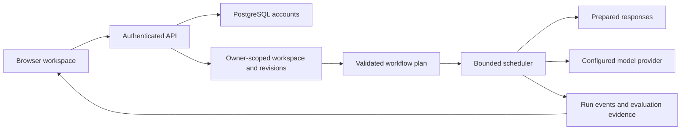
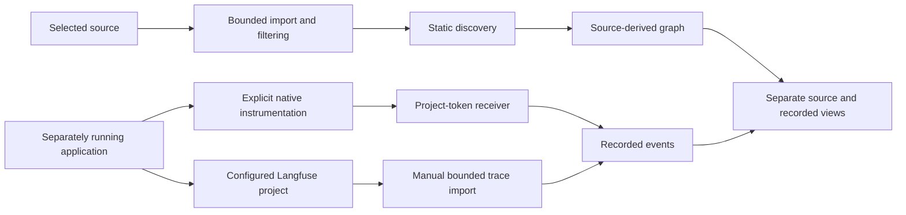

# Citadel architecture

Citadel combines a visual workflow editor with bounded execution, source discovery and recorded telemetry. Source discovery and execution evidence have different meanings: a relationship found in code is not a recorded model call.

The local setup uses fixture storage and mock providers. Workflow execution checks spending limits before dispatch. Secrets are held in server-side memory and scrubbed from persisted evidence and exports. A restart requires reconnecting optional integrations.

See [connection setup](CONNECTIONS.md) for supported APIs, URL restrictions and limits. Only selected reviewed adapters execute imported source. Unsupported execution fails closed; arbitrary repositories are not treated as safe runnable code. Native tracing sees instrumented operations only. Imported parent spans indicate recorded nesting, not exhaustive data flow.

Evaluations compare fixed inputs using explicit assertions and optional model judgments. Phrase or schema checks do not prove factual accuracy. Export assembles a local executable package; each download still needs its own install, tests and provider configuration.

The current collection build and test evidence is in [BUILDCRAFT.md](../BUILDCRAFT.md). Historical deployment receipts and private infrastructure diagrams are not part of this snapshot.
