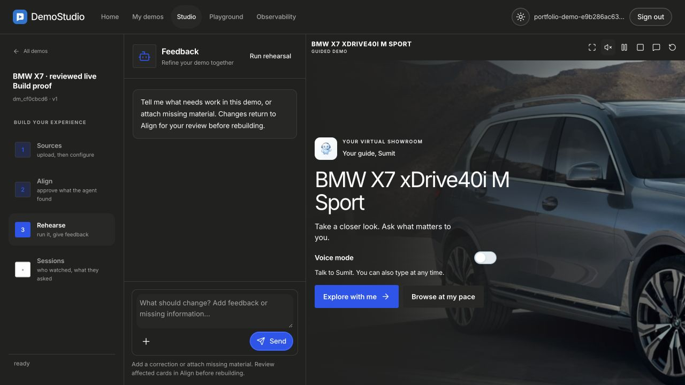
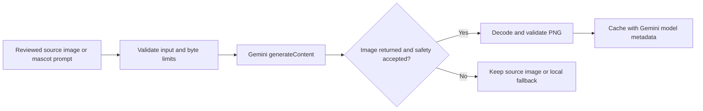

# Demo Studio

Turn source material into an interactive, cited product demonstration. The system extracts facts, proposes a story, asks a human to review six alignment cards, and builds a player whose recorded narration drives the screen.


*Existing portfolio interface screenshot. It illustrates the source application, not a new live Gemini run.*

## What makes this useful

- **Evidence before claims.** Authored claims and runtime answers reference reviewed source facts. Unsupported questions are declined.
- **A real human checkpoint.** Sources → Read → Align → Build → Rehearse; the six approvals gate publication.
- **A gallery that follows speech.** Audio events lead slide changes, feature callouts and interruption recovery.
- **Direct Gemini image generation and editing.** Product cleanup sends reference image bytes; a guide mascot uses a text prompt. The source image remains intact and generated assets retain provider metadata.
- **A free local example.** A fictional vehicle handbook, original geometric art and intentionally silent audio exercise publication, cited answers and the player without keys.

## Start locally

Python 3.11+ is required. Run these commands from this directory:

```bash
python3 -m venv .venv
source .venv/bin/activate
pip install -r requirements.txt -c requirements-lock.txt
cp .env.example .env
python -m uvicorn server.app:app --host 127.0.0.1 --port 8877
```

Open [localhost:8877](http://127.0.0.1:8877). Use the example button to create the synthetic handbook. Its audio is silence by design; it is a deterministic UI and data-flow example, not recorded speech. A new demo can also accept your own sources.

`MOCK_LLM=1` and `PORTFOLIO_AUTH_ENABLED=0` are local fixture settings. Real-provider mode requires creator authentication, your own PostgreSQL database, `AUTH_SECRET`, and provider keys as described in `.env.example`. Optional source rendering needs an installed Chromium browser. Optional live voice needs the separate LiveKit services; the cached example disables live providers.

## The image path



Set `GEMINI_API_KEY` and optionally `GEMINI_IMAGE_MODEL` (default `gemini-3.1-flash-image`). Text and speech have independent configuration. Provider safety refusals stop the image request; the app does not submit a refused prompt to a second provider. Responses, pixels and time are bounded, and raw provider bodies and keys are not logged. No price is invented when the response has no currency cost.

API contracts: [Gemini images](https://ai.google.dev/gemini-api/docs/generate-content/image-generation) · [generateContent reference](https://ai.google.dev/api/generate-content).

## Verify without model spend

An installed Chrome or Playwright Chromium is required for the final browser contract. If needed, install Chromium once with `python -m playwright install chromium`.

```bash
python scripts/run_free_checks.py
```

The runner isolates storage, disables dotenv loading and blocks outbound Python sockets. It covers Gemini transport, image caching, the synthetic example, stage/player behavior, bad uploads and the release pipeline. Broad plumbing checks use explicit narration fixtures; the release contract checks normal measured-duration and approval gates. See [BUILDCRAFT.md](BUILDCRAFT.md) for the exact results and limits.

The fixture art can be regenerated with `python scripts/make_synthetic_assets.py`.

## Explore or contribute

Start with `server/graph.py` for orchestration, `server/agents/` for stages, `server/llm/image_media.py` for Gemini media, and `web/player/` for playback. Useful contributions include new evidence-preserving source readers, stronger counterexamples for citation validation, and accessible player controls. Changes to claim handling should include an example that would otherwise invent or misattribute a fact.

This edition excludes production deployments, customer state, historical operator material and third-party product media. No live model quality, voice quality or production hosting claim is made for this copy.
