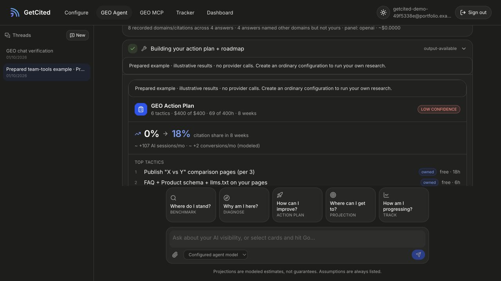

# GetCited

Compare model answers about a brand, turn observations into an explicit plan, and track the resulting work. Prepared examples show the workflow; ordinary probes provide directional evidence that needs interpretation.



## Local setup

Use Node 22 and the pinned pnpm version in `package.json`.

```bash
pnpm install --frozen-lockfile
cp .env.example .env.local
```

Create a fresh PostgreSQL database and apply `migrations/001_portfolio.sql` as its administrator. Give the runtime role table data permissions, not schema ownership. Set the database URL/name, independent Auth.js secret, exact origin and a fresh 32-byte base64 encryption secret. Keep `GETCITED_MOCK_MODE=1`, the loopback preview settings and all provider keys empty.

```bash
pnpm dev --hostname 127.0.0.1 --port 8986
```

Open **http://127.0.0.1:8986**, create a local account, then choose **Try with an example**. Inspect the prepared report and plan; explicitly approve it into Tracker, update remarks/status and download the documents. Historical `drizzle/` migrations describe an earlier storage stack and are not the fresh-schema setup above.

## What the numbers mean

Share of voice is tracked-brand mentions divided by total mentions of the tracked brands. A single-response probe does not search the web; domain-shaped text in an answer is not a verified citation. Projections are modeled assumptions, not promised gains. Northstar is a fictional example brand.

The application retains owner-scoped accounts/configurations, threads, reports, plan approval, a tracker, document exports and account-consented MCP access. Tab-only BYOK and optional encrypted server storage have different lifetimes; signing out clears active account state. Password recovery and social login are not configured.

```bash
pnpm typecheck
pnpm test
```

See [BUILDCRAFT.md](BUILDCRAFT.md) for collection verification and limits, and [SOURCE.json](SOURCE.json) for provenance. No paid probe, current visibility benchmark or production deployment was validated here. Screenshot: historical portfolio illustration.
