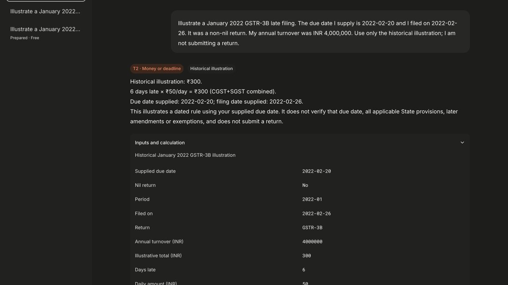

# GSTPilot

GSTPilot is a source-oriented GST workspace for small businesses. Ask in English or Hinglish, review citations and remembered business details, or inspect a historical filing calculation. Its corpus is limited and dated; it does not verify current tax liability or submit returns.



## Try it in three steps

1. After local setup below, open the app and create an account with an email and a password of at least 12 characters.
2. Choose **Try with an example · Free**. The prepared January 2022 GSTR-3B example uses fixed server-owned inputs, the existing calculator and normal conversation persistence, without a provider request.
3. Open **Inputs and calculation** and the official source links. Reload to restore the conversation, or choose **Analyze your own facts** to start a separate editable analysis.

The prepared example illustrates six days at ₹50 per day, giving ₹300. The due date is supplied as an input. That calculation is not a determination of current liability, all State provisions, exemptions or later amendments.

## What works together

- **Chat:** the existing intake, lane routing, clarification, citation, calculator, memory-confirmation and Chartered Accountant handoff flows.
- **Filing analysis:** one bounded model request extracts fields, then code validates the historical scope and applies the existing formula. Supported scope is January 2022 GSTR-3B, supplied February 2022 due dates, filing by March 2022 and turnover up to ₹5 crore. Missing or unsupported facts produce a clarification or limit.
- **Account history:** conversations, extracted filing inputs and prepared provenance are stored under the signed-in owner. Profile and memory controls support corrections and deletion.
- **Evidence views:** read-only source inspection, owner-scoped conversations, retrieval traces, evaluation runs, architecture diagrams and personal feedback triage. Retrieval and label drafting require explicit submission and can use the configured provider.
- **Shared UI:** self-hosted Inter and Roboto Mono, Lucide icons, neutral Lovable tokens, light/dark themes, compact mobile navigation and contained evidence tables.

Changing accounts clears the visible workspace and rejects delayed JSON or streamed results. The server separately checks sessions, ownership and mutations; browser state is not an authorization source.

## Local development

Use Node 24 and the repository's pinned pnpm dependencies. Provision a **fresh** PostgreSQL database with pgvector; apply the eleven ordered files in `supabase/migrations` as an administrator. These paths retain their historical name; the hosted application uses direct PostgreSQL, not Supabase. Use a separate runtime role with data permissions only, read-only access to the shared corpus and no corpus-refresh function permission.

Configure the current variables from `.env.example`, including the application origin, Auth.js secret, database name/URL and verified database CA. Do not reuse an old database or service-role key. Install with `pnpm install --frozen-lockfile`, then start with `pnpm dev --hostname 127.0.0.1`. For a separate local production preview, set `PUBLIC_ORIGIN` and `AUTH_URL` to the same loopback URL and port used in the browser. Retain the explicit local-preview and mock settings from `.env.example`, and bind only to loopback:

```bash
export PUBLIC_ORIGIN=http://127.0.0.1:8981
export AUTH_URL=http://127.0.0.1:8981
GSTPILOT_DIST_DIR=.next-integrated pnpm build
GSTPILOT_DIST_DIR=.next-integrated pnpm start --hostname 127.0.0.1 --port 8981
```

Set `GSTPILOT_MOCK_MODE=1` with blank provider keys for local provider-free tests. The canonical prepared example remains free when mock mode is off. Ordinary editable input is never silently treated as the prepared example.

## Verification and limits

The collection includes the application source, ordered schema migrations and synthetic prepared filing example. It does not validate current tax rules or file returns. Follow [BUILDCRAFT.md](BUILDCRAFT.md) for the checks performed here and [SOURCE.json](SOURCE.json) for provenance. Screenshot: historical portfolio illustration.

Run free checks with `pnpm exec tsc --noEmit`, `pnpm test:providers`, and `pnpm exec tsx --test tests/client-identity.test.ts tests/client-citations.test.ts`. The answer/retrieval evaluation scripts require their own corpus and may invoke configured providers; they were not run for this collection.
