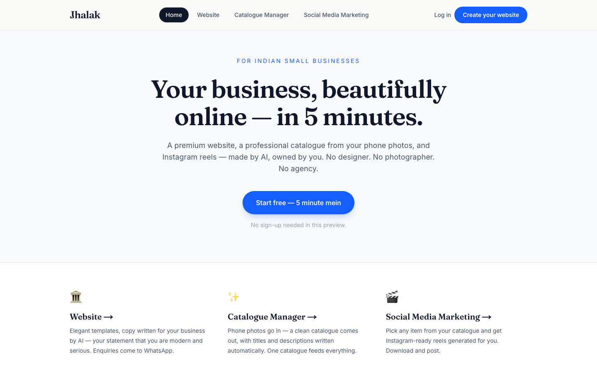
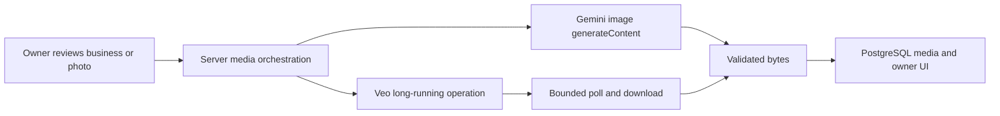

# Jhalak

A small-business website, product catalogue and media studio in one Next.js app. Owners describe a business, review its AI-written copy, upload product photos and edit the resulting site through a chat-driven studio.


*Existing portfolio interface screenshot. It illustrates the source application, not a new live Gemini run.*

## What is implemented

- Account creation, signed sessions, owner checks and PostgreSQL persistence.
- A guided business brief and an import-and-review workflow for an existing website.
- Four storefront templates, a catalogue, editable content sections and lead collection.
- Anthropic text/vision calls for site copy, catalogue descriptions and editing intent.
- Direct Gemini image generation, photo enhancement and portrait image posts.
- Direct Gemini API Veo image-to-video generation for portrait reels, with bounded polling and download.

Generated images are saved as bytes in the application's media table. Gemini receives inline reference bytes, so local images do not need to be exposed through a public URL to edit them. The original upload remains available if optional enhancement fails.

## Local setup

Use Node.js 24+ and PostgreSQL. From this directory:

```bash
npm ci
createdb jhalak
cp .env.example .env.local
node -e "console.log(require('crypto').randomBytes(32).toString('hex'))"
```

Paste the generated value into `AUTH_SECRET`, and adjust `DATABASE_URL` for your local PostgreSQL user. `DATABASE_SSL=disable` is for local databases. Remote databases use certificate verification.

```bash
npm run dev
```

Open [localhost:3000](http://localhost:3000), create your own account, and start a business. The database schema initializes on first use. There is no shared demo account or bundled password.

Optional free template examples:

```bash
node --env-file=.env.local scripts/seed-synthetic.mjs
```

This script accepts only a loopback PostgreSQL database, creates four clearly fictional businesses, leaves existing rows untouched and makes no model requests. Template art falls back to local CSS; no third-party images are included.

## Provider configuration

Put keys in `.env.local`, never client code:

- `ANTHROPIC_API_KEY`: website copy, catalogue vision and studio editing.
- `GEMINI_API_KEY`: generated images and video.
- `GEMINI_IMAGE_MODEL`: defaults to `gemini-3.1-flash-image`.
- `GEMINI_VIDEO_MODEL`: defaults to `veo-3.1-fast-generate-preview`.

Your account must have access and quota for the chosen models. Without the media key, original photos remain usable and the reel studio reports that generation is unavailable. Model requests can incur charges. This edition has made no paid verification calls.



## Verify

```bash
npm run test:media
npx tsc --noEmit
npm run build
```

The seven media contracts use mocked HTTP, with unexpected global network calls blocked. They exercise generation, reference editing, refusals, corrupt data, Veo polling, timeouts and download credential handling. TypeScript and production compilation pass. These checks do not verify a complete database-backed journey or live model output; details are in [BUILDCRAFT.md](BUILDCRAFT.md).

## Contributor starting points

`src/lib/gemini-media.ts` owns provider transport; `mediaai.ts` owns persistence; `imagery.ts` and `jobs.ts` sequence generation under existing quotas. `src/lib/tenant.ts` and `src/app/s/[slug]/` define the storefront. Good next contributions include durable background jobs, image dimension validation, media storage adapters and account recovery.

The app currently stores media in PostgreSQL and starts background work within the web process. Run it as a persistent Node service for experiments. A production launch needs dedicated workers, storage sizing, and a separate security review. Import accuracy and generated product fidelity always require owner review.

Official API documentation: [Gemini images](https://ai.google.dev/gemini-api/docs/generate-content/image-generation) · [Gemini Veo](https://ai.google.dev/gemini-api/docs/veo).
