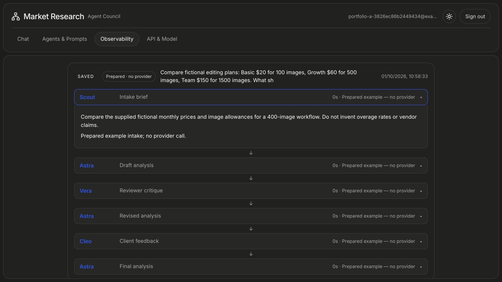

# Market Research · Agent Council

Scout turns a question and uploaded sources into a brief. Astra drafts the analysis; Vera challenges it; Cleo reviews it from the client's perspective. Inspect the trace, revise the prompts, reorder review stages and export the resulting report.



## Free local fixture

Requires Python 3.11+ and Node 22+. From this directory:

```bash
python3.11 -m venv .venv
.venv/bin/pip install -r requirements-lock.txt
(cd frontend && npm ci && npm run build)
env -i PATH="$PATH" HOME="$HOME" \
  MRA_MOCK_MODE=1 MRA_STORAGE_MODE=fixture PORTFOLIO_STORAGE_MODE=fixture \
  PORTFOLIO_AUTH_ENABLED=0 PUBLIC_BASE_URL=http://127.0.0.1:8600 \
  .venv/bin/uvicorn app.main:app --host 127.0.0.1 --port 8600
```

Open **http://127.0.0.1:8600**. Choose a prepared example, inspect the agent steps and export the report. This explicit local fixture uses temporary memory, disables research/provider tools and skips accounts. Restarting clears it.

Prepared examples cover a fictional AI-editing opportunity, invented competing plans and an authorized-media product idea. Their numbers are illustrative, not current market findings.

## What is included

Detached conversations, optional reviewers, expert framework lenses, custom stages, document/image intake, observability and PDF/PPTX export. Real providers support OpenAI, Anthropic and Hugging Face routes. Authenticated persistence additionally requires PostgreSQL, `app/migrations/001_portfolio.sql`, application secrets and private versioned S3 storage.

A single worker retains active runs in process; after a restart unfinished work is marked interrupted. Model recommendations and exports need human review. The collection does not include a production deployment or a current research-quality claim.

```bash
(cd frontend && npm test && npm run build)
.venv/bin/python -m unittest discover -s tests -p test_backend_contracts.py
.venv/bin/python -m unittest discover -s tests -p test_safe_network.py
.venv/bin/python -m unittest discover -s tests -p test_upload_storage.py
```

The separate HTTP-account harness requires an explicitly prepared disposable database/server. See [BUILDCRAFT.md](BUILDCRAFT.md), [SOURCE.json](SOURCE.json) and the [architecture viewer](docs/architecture-flow.html). Screenshot: historical portfolio illustration.
