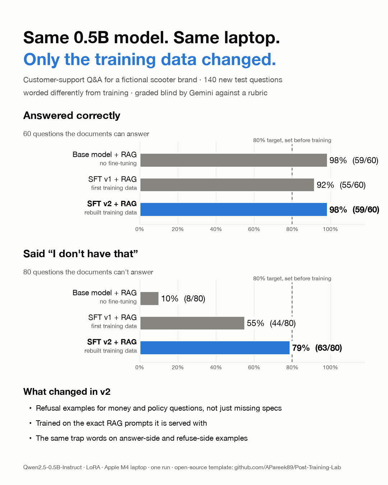

# v2 · Teaching a 0.5B model to say "I don't know"

v1 of this lab ended with a clear failure: the best setup (SFT + RAG) answered 87% of questions
correctly but declined only 11 of 20 questions the documents cannot answer. The bar was 80%.
v2 keeps the **same model, LoRA settings, documents and laptop**, and changes only the data
and the way it is measured.

## What v1 got wrong, and what v2 changes

| v1 finding | v2 change |
|---|---|
| 94% of SFT refusal examples were "spec/feature not listed". Money and policy near-misses (60% of dev_v1's unanswerable questions) were almost absent. | Refusal mix: 35% money, 22% policy, 19% spec, 12% feature, 12% company. |
| Lexical traps: "storage under the seat" refused as "seat height"; "on-road *charge*" answered with a charging time. | Trap families: the same words appear in answer-side and refuse-side examples. |
| Invented caveats appended to correct answers; refusals opening with an unrelated fact. | No hedge clauses in answers; every refusal starts "I don't have …". |
| SFT trained without documents, served with retrieved documents. | SFT prompts are byte-identical to evaluation prompts: system prompt + 3 retrieved chunks, including look-alike chunks and examples where the right chunk was removed. |
| 61% of training questions used the full official model name; real questions use short names. | 66% short names, 12% typos, scenario framing. |
| DPO changed 2 of 280 answers: 59 template pairs with absurd rejected answers, and the reference model was the base, not SFT. | On-policy pairs from SFT v2's own mistakes, confirmed by a judge; DPO trains a new LoRA on the merged SFT model, so the reference really is SFT. |
| A keyword scorer that missed reworded refusals and dropped truncated answers. | A Gemini judge with a fixed rubric, gated by a 60-item calibration set (100% agreement), plus the keyword scorer for continuity. |

## Results so far (one run, Apple M4, float32)

**dev_v2** is new: 140 questions (60 answerable, 80 unanswerable in four categories), worded by
Gemini from specs so it shares no templates with training, and with every unanswerable topic held
out of training. **dev_v1** is the main lab's 50-question set; v2 was designed from its failures,
so treat it as a regression check.

**Same questions, same ruler.** All three models answered with RAG (3 reranked chunks), and the
Gemini judge graded all of their answers together, blind and shuffled
(`data/reference_results_rag_compare.json`):

| Model + RAG | dev_v2 correct (of 60) | dev_v2 declined (of 80) | dev_v1 correct (of 30) | dev_v1 declined (of 20) |
|---|---|---|---|---|
| Base, no fine-tuning | 98% | 10% | 87% | 10% |
| SFT v1 (main lab) | 92% | 55% | 87% | 35% |
| **SFT v2** | **98%** | **79%** | **97%** | **90%** |

Declined, by dev_v2 category, for SFT v1 → SFT v2:

| Category | SFT v1 | SFT v2 |
|---|---|---|
| Price | 11/20 | 16/20 |
| Policy | 10/20 | 17/20 |
| Spec | 8/20 | **12/20** (the remaining weak spot) |
| Out of scope | 15/20 | 18/20 |

Wrong values on answerable dev_v2 questions, with RAG: base 1, SFT v1 4, SFT v2 0 (of 60).

**At the bar, not past it.** The pre-declared bar is: accuracy ≥ 80%, hallucination ≤ 10%,
correct refusals ≥ 80%, over-refusal ≤ 15%.
- A separate judging pass of the *same* SFT v2 answers gave 82.5% (66/80) declined on dev_v2.
  So the judge moves by about 3 points between passes.
- The 95% interval for 63/80 is 69–86%.

SFT v2 + RAG sits at the bar on dev_v2 and clears it on dev_v1.

**SFT v2 under other prompts** (`data/reference_results_sft_v2.json`):

| Eval set | Condition | Accuracy | Hallucination | Over-refusal | Declined |
|---|---|---|---|---|---|
| dev_v2 | prompt only | 60% | 33% | 7% | 74% |
| dev_v2 | all 5 documents in the prompt | 45% | 7% | 48% | 74% |
| dev_v2 | oracle (only the right chunk) | 100% | 0% | 0% | – |

**The trade-off:** SFT v2 is strong only in the format it was trained on. With all five documents
pasted into the prompt it over-refuses half the time, and without documents its recall is weaker
than v1's. Train in the format you serve.

**DPO v2:** the on-policy pairs are built (98 real failures plus 42 look-alike pairs, capped at 30%)
and ship in `data/`. DPO training and the full five-model evaluation (notebooks 03 and 04) have not
been run for this release.

## Run it

Run the main lab's setup first (`notebooks/00a`, `00b`), so the base model is in `models/`. Then:

| Notebook | What it does | Needs | Time on an M4 |
|---|---|---|---|
| `00_data_v2` | Loads and audits the v2 data; v1 vs v2 volume tables | – | 1 min |
| `01_sft_v2` | SFT from the base model on 1,759 RAG-format examples, then evaluates it under four conditions | `GEMINI_API_KEY` for the evaluation section | ~2 h training, ~30 min evaluation |
| `02_dpo_pairs_v2` | SFT v2 answers 600 prompts (greedy + samples); Gemini confirms failures; builds pairs | `GEMINI_API_KEY` | ~75 min |
| `03_dpo_v2` | Merges SFT v2, trains a new LoRA with DPO (reference = SFT v2) | – | ~20–30 min |
| `04_final_eval_v2` | 5 models × 4 conditions × dev_v1 + dev_v2; Gemini judge + keyword scorer | `GEMINI_API_KEY` | ~90 min |

- **No Postgres needed.** Retrieval results for every question are frozen in `data/retrieval_snapshot.json`.
- **Resumable.** Generations and judge verdicts are cached under `v2/runs/`.
- **On a Mac,** `scripts/run_guarded.sh` runs a notebook headless with a memory watchdog (`scripts/watchdog.py`) and a capped MPS allocator. If memory gets tight you get a clean error, not a frozen machine.
- **On a rented GPU,** device selection is automatic (cuda → mps → cpu). Untested on CUDA.

## Rebuild or change the data

| Script | What it does | Needs |
|---|---|---|
| `scripts/build_dev_v2.py` | Writes the dev_v2 questions with Gemini, then checks answerability | `GEMINI_API_KEY` |
| `scripts/build_sft_dpo_data.py` | Builds SFT v2 and the DPO prompts from `data/raw/facts.json` and templates; retrieves contexts; runs the audits | the main lab's retrieval index (notebook 11) |
| `scripts/build_judge_calibration.py --run` | Builds and checks the 60-item judge calibration set | `GEMINI_API_KEY` |
| `scripts/build_notebooks.py` | Rewrites the five notebooks | – |
| `scripts/headline_compare.py` | Base vs SFT v1 vs SFT v2 with RAG, judged together (the table above) | `GEMINI_API_KEY`, the main lab's SFT adapter |
| `scripts/make_results_image.py` | Draws the results image from that comparison | – |

To adapt v2 to your own domain, the parts to replace are:
- `data/raw/` and `facts.json`, the main lab's facts
- the unanswerable topic lists in `v2lib/topics.py`, keeping eval and training topics disjoint
- the question and answer templates in `scripts/build_sft_dpo_data.py`
- the judge rubric in `v2lib/judge.py`

## Share your results

Open an issue with the **Share your results** template: model, what you changed, hardware, and the
same results table. Different models, domains and failures are all useful.

## Caveats

- Single runs. Small eval sets: one dev_v2 refusal question is 1.25 points.
- dev_v2 is independent at the topic level, but covers the same 48 facts the model trains on. That is the point of this lab, not a test of unseen knowledge.
- The judge is a model too: read the disagreements notebook 04 lists before trusting a borderline number.
- `../evals/heldout.json` is untouched by v2. Run it once, after every choice is fixed.
