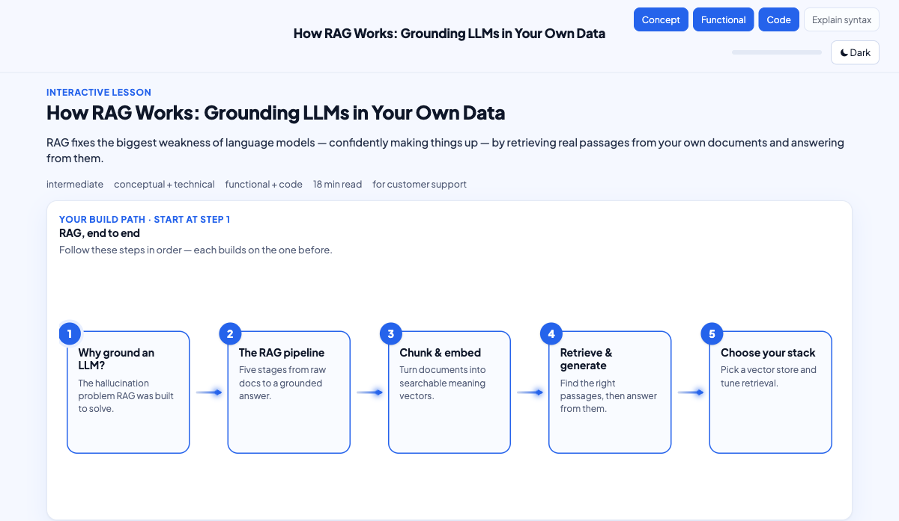
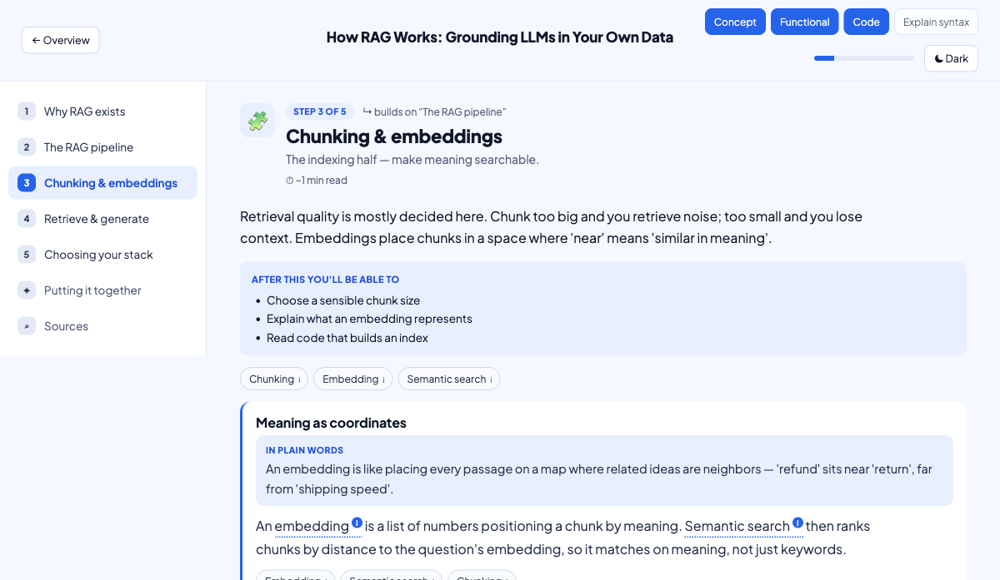

# 🎓 Agentic Learning Studio — a portable Claude skill

**Turn any topic into a single, self-contained interactive HTML lesson** — mental-map
first, click-to-deepen modules, `(i)` glossary tooltips, business **and** code examples,
and a graded knowledge check. Or **turn a brief into an installable Agent Skill**.

It runs **entirely on your own Claude** — no server, no API key, no account, no database.
You (the model) write a typed *Blueprint*, and a bundled zero-dependency renderer turns it
into one HTML file you can double-click. This is the lesson-generation methodology of the
hosted [**Agentic Learning Studio**](https://prathibhax.com/?utm_source=github&utm_medium=skill&utm_campaign=als_skill),
packaged to be shared.

| Overview (mental map) | Inside a module |
|---|---|
|  |  |

> ▶ **Prefer a hosted, zero-setup experience** — a 100-lesson library, saved progress,
> document uploads, and live grounding? Try the live app at
> **[prathibhax.com](https://prathibhax.com/?utm_source=github&utm_medium=skill&utm_campaign=als_skill)**.

---

## What it does

**A — Generate a lesson.** Say *"teach me X"* and Claude asks one quick line (your level,
goal, depth — or just say **"go"** for sensible defaults), then writes a complete lesson
and renders it to `lesson.html`:
- a **mental map first** (the advance organizer), laid out by the topic's true shape;
- **4–6 modules** you click into, sequenced for retention (worked → completion → solo);
- inline **`(i)` tooltips** on key terms, **decision matrices** where there's a choice,
  optional **interactive visuals**, **predict-then-reveal** code, and a **graded knowledge
  check** at the end — all working offline in one file.

**B — Build a skill.** Say *"build a skill for X"* and Claude turns your brief into an
installable Agent Skill (`SKILL.md` + structure), ready to drop into `~/.claude/skills/`.

The core idea: **the model emits data (a Blueprint), a deterministic renderer makes the
HTML.** That's why the interactivity is always reliable.

## Install

### Option 1 — as a plugin (recommended)

```
/plugin marketplace add APareek89/agentic-learning-skill
/plugin install agentic-learning-studio@agentic-learning-studio
```

### Option 2 — drop-in skill (no plugin system)

Clone, then symlink the skill folder into your Claude skills directory:

```bash
git clone https://github.com/APareek89/agentic-learning-skill.git
ln -s "$(pwd)/agentic-learning-skill/skills/agentic-learning-studio" \
      ~/.claude/skills/agentic-learning-studio
```

**Requirement:** [Node.js](https://nodejs.org) 16+ (for the bundled renderer). Check with
`node --version`. No other dependencies.

## Usage

Just talk to Claude — the skill triggers on natural phrasing:

```
You: teach me how RAG works, I'm a backend dev building a support bot
Claude: Quick check — level (beginner/intermediate/advanced), your goal, and how deep?
        Or say "go" for an intermediate conceptual+technical lesson with code + examples.
You: go
Claude: → writes blueprint.json, runs the renderer →
        ✓ Your lesson is at ./lesson.html — open it and start at the mental map.
```

More examples:

```
make an interactive lesson on transformer attention, beginner, concepts only
```
```
teach me Kubernetes networking, advanced — focus on failure modes
```
```
build a skill that audits a webpage's SEO and writes a report
```

The generated `lesson.html` is fully self-contained: open it by double-click, share it,
host it anywhere — it needs nothing else (only Google Fonts, with a system-font fallback).

## How it works

```
your request
   │  Profiler   → resolve level / depth / examples + the real intent (lessonFocus, mustCover)
   ▼
 Blueprint (JSON)   ← you write this: meta, mentalMap, modules[], glossary, synthesis
   │  scripts/render.mjs  (normalize → repair → render; zero dependencies)
   ▼
 lesson.html   ← one self-contained interactive file
```

The renderer ports the real product's components, CSS, and inline runtime, and adapts three
things for offline use: every module is rendered up front (no background server build), the
knowledge check **grades in the browser** (answer key embedded; free-text reveals a model
answer), and there are no API/database/auth calls. See
[`references/methodology.md`](skills/agentic-learning-studio/references/methodology.md).

## What's in the box

```
agentic-learning-skill/
├── .claude-plugin/
│   ├── plugin.json                 # plugin manifest
│   └── marketplace.json            # so `/plugin marketplace add` works
├── skills/agentic-learning-studio/
│   ├── SKILL.md                    # entry point — triggers + workflow (both capabilities)
│   ├── references/
│   │   ├── methodology.md          # the conceptual model (why it's reliable)
│   │   ├── blueprint-schema.md     # the exact Blueprint JSON contract
│   │   ├── authoring-guide.md      # the pedagogy — how to make a lesson good
│   │   └── skill-authoring.md      # capability B — brief → installable Agent Skill
│   ├── scripts/
│   │   └── render.mjs              # zero-dep Blueprint → self-contained HTML
│   └── examples/
│       ├── blueprint.sample.json   # a complete sample Blueprint
│       └── sample-lesson.html      # its rendered output
├── examples/                       # the same sample, for easy browsing
├── assets/                         # screenshots
├── LICENSE                         # MIT
└── README.md
```

## Try the sample renderer

```bash
node skills/agentic-learning-studio/scripts/render.mjs \
     examples/blueprint.sample.json my-lesson.html
# → open my-lesson.html
```

## Credits & license

Distilled from the hosted **[Agentic Learning Studio](https://prathibhax.com/?utm_source=github&utm_medium=skill&utm_campaign=als_skill)**.
Released under the [MIT License](LICENSE). The bundled renderer carries no secrets, server
code, or credentials — only the methodology, schema, and template.
